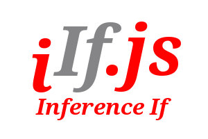

# iif.js Inference IF Engine

## Simple Inference Engine for javascript

Include an inference function directly within your javascript code.

Implements a forward chaining expert system working with facts and
javascript code within the inference process.

## Use it for:

- Replacing complex procedural logic.

- Helping with Natural Language processing.

- Further analysis of machine learning output.

- Helping capture domain specific knowledge.

- Other ??

## Why Use An In Line Inference Engine

In some projects the logic needed to implement some business or application
rules becomes unwieldy when written as a set of IF statements. In these
situations I have found the inference IF approach useful. Depending on the
problem being addressed when the business rule count starts to exceed eight to
twelve rules it may be better to consider moving towards using a simple
engine like Iif.js.

A move to using an inference IF approach is a judgement call. These are some guidelines I have followed for choosing to move logic into
an inference IF set of rules:

1. The business logic is still unfolding and your code already looks
like a rat's nest. Applying change or new rules is causing you severe brain
ache.

2. You have a lot of parameters involved in the decision flow.

3. In the middle of a nicely structured set of rules you find an almost
arbitrary condition that is difficult to accommodate neatly in your code.

4. The business rules have a number of layers and parameters are inferred from
a lower layer for use in a higher layer.

5. You encounter two or more business rules with overlapping parameters (or completely different parameters) that need to be arbitrated/prioritised in some
 way.

All of these situations can be solved using in line coding of the rules but I
have found having an inference IF to hand can shorten the coding and testing
time. Your code becomes easier to read.

## History.

Originally this function was written in Forth (circa 1979) and used with a
Reuters Foreign Exchange price feed from a PDP-8. The price protocol structure changed with currency pairs, we spent six weeks not getting the in line code to
run reliably. Switching to a rule engine we had it working reliably in 48 hours.

Since then I have rewritten in Perl and Ruby, using it within a number of
software products and services.

## Performance.

The rule engine runs at around 1 million rules per second on a Intel® Core™ i5-4200M CPU @ 2.50GHz × 4 core lap top. This test runs a flip-flop emulation
with two rules, a counter and a end rule (three rules in total).

Performance decreases as:
- the number of rules in your knowledge base increases.
- the complexity of the IF clauses increase.

## Installation

Download:

git clone https://github.com/myichild/iifjs.git iifjs

Add Iif.js to your application

Copy the file ./iifjs/src/Iif.js into your application's src/ or lib/directory.

## Example - Benchmark flip-flop minimal rule set

This knowledge base demonstrates:

- adding properties to the KB object for use in your code.

- the rule structure, a list of rule objects in a KB object.

- how to use KB object properties within rules.

- how to force the end of inference from a stop rule.

- how to make a rule re-testable with the repeatable: property 

When the inference process terminates the KB state will reflect the conclusion
reached. This may be a result in a property or a change of state in the 
fact stack. In the example below when rule "Count up to stop" fires it adds
a fact "Test Concluded" with a status of true to the fact stack.

```javascript

  var Iif = require('../src/Iif.js');

  var benchMarkKB = {
    properties: "this.maxCycles = 1000000; this.count = 0; this.stopAt = this.maxCycles; this.state = false;",
    rules: [
      { name: "Flip",
             if: 'this.state === false',
             then: 'this.state = true; this.count++;',
             priority: 1,
             repeatable: true,
             because: 'Flips false state to true'},
      { name: "Flop",
        if: 'this.state === true',
             then: 'this.state = false; this.count++;',
             priority: 1,
             repeatable: true,
             because: 'Flips a true state to false'},
      { name: "Count up to stop",
        if: 'this.count >= this.stopAt && this.running === true',
             then: 'this.running = false; this.facts("Test Concluded", true);',
             priority: 10,
             because: 'Stop the engine with a stop rule because we have repeatable rules'}
      ],
    };

// create an inference object
var iif = new Iif(); 

// load a knowledge base
iif.load(benchMarkKB);

var start = new Date();

// run inference
iif.run();

var stop = new Date();

if(iif.done === true) {
  console.log("Test conducted OK");
} else {
console.log("Test failed to run");
}

// can see the fact stack has changed as a result

console.log('Fact stack records a conclusion for "Test Concluded" is ' + iif.facts("Test Concluded"))

// report the benchmark performance for one million cycles
console.log('Lapsed time for ' + iif.maxCycles + ' inference cycles = ' + lapsed + ' seconds.');
console.log('Inference Rate: ' + Math.floor((iif.cycles + 0)/lapsed) + ' rules per second.');

```
